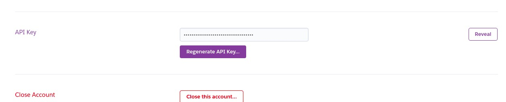

node-heroku-cli
===

Docker image with heroku cli installed to deploy node applications on from pipelines.

## Based on `node:slim` image.

## What is Installed?
 - [heroku cli VIA npm](https://devcenter.heroku.com/articles/heroku-cli#download-and-install)

## VARIABLES
 - HEROKU_API_KEY

Generate the `API KEY` on your [Manage Account area](https://dashboard.heroku.com/account).

